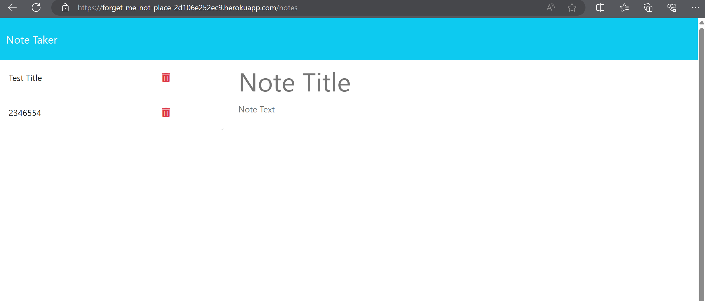

# Note Taker Application
A website to record and save notes. We were given starter code for this application. The main focus was to create the server.js file and then populate with dependencies, routes, etc.

### Purpose 
To assist a small business owner with writing and saving notes so they can better run their business. This is a fantastic way to keep track of meeting notes, site visits, sales calls, or whatever the business may require.

### Links

[Link to my Github repository](https://github.com/anplace/Forget-Me-Not)

[Link to the deployed site](https://forget-me-not-place-2d106e252ec9.herokuapp.com/)

Site as of 03/07/2024:

### Credits

@PedroTech's Youtube account to help with deploying to Heroku
@jhf1203's Youtube account for helping with the code within the server.js file